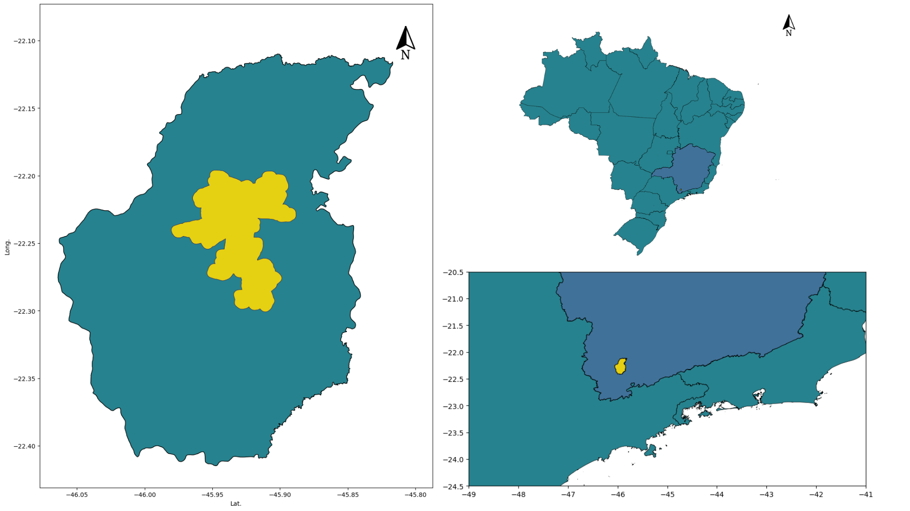
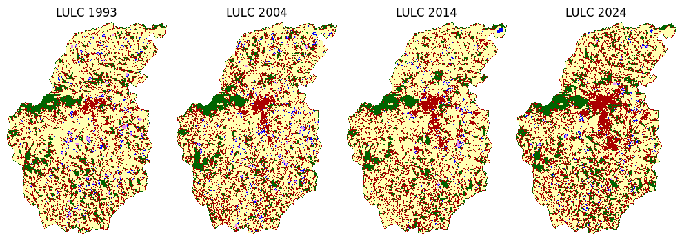
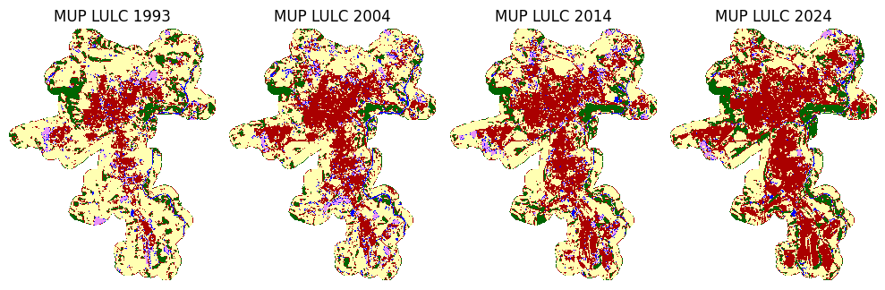
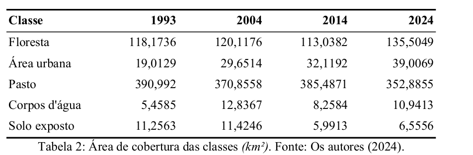
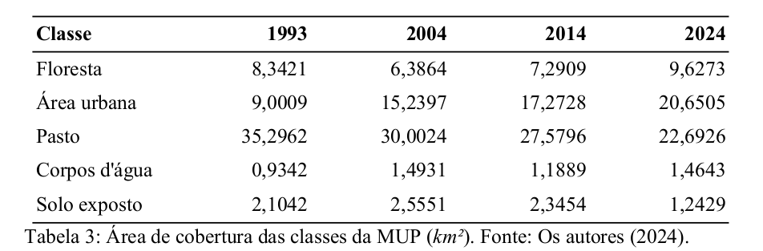

# Autores: 
1. Rodrigo Zonzin (UFSJ)
2. Cauã Lima (UFPA)

## Região em estudo

## Mapa de Uso e Cobertura obtido após a classificação temática de 4 imagens Landsat
Bandas utilizadas: RGB, Infravermelho Próximo, Infravermelho de Ondas Curtas, NDVI (índice de vegetação) e NDWI (índice de água)

## Mapa de Uso e Cobertura da Mancha Urbana Principal (MUP)
Recorte baseado nos setores censitários classificados como de 'Alta Densidade de Edificações'

## Evolução da área urbana ($km^2$)
### Geral

### MUP

